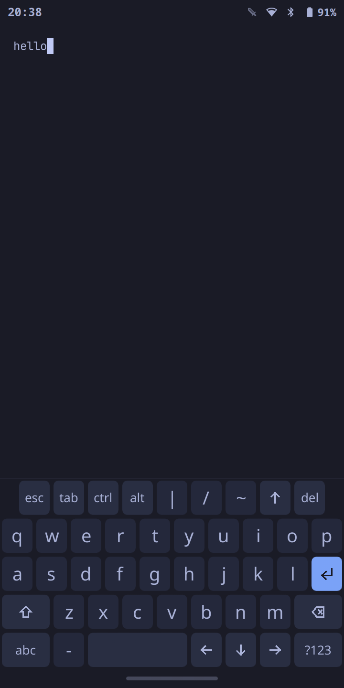

# moarchy-keyboard

An on-screen keyboard for the PinePhone running
[mobileomarchy](https://github.com/SimonSchubert/mobileomarchy): Qt6 + QML, themed live from Omarchy's
palette, rendered on the Mali-400.

It replaces squeekboard, which behaves correctly but ignores the theme and draws
through cairo on the CPU.



## Status

Working and verified on the phone. It raises and retracts itself, types into
both kinds of Wayland client, recolours live on `omarchy-theme-set`, and keeps
exactly one layer surface for the life of the process.

[RESULTS.md](RESULTS.md) tracks every acceptance criterion in
[SPEC.md](SPEC.md), with the measurement behind each one. Of 49: **41 pass, 2
fail**, 3 are partial, and 3 await a slot on the shared device. Both failures
are targets set without evidence — 25 MB of PSS and 800 ms to first paint — and
both are answered there with a measurement rather than defended.

Not yet landed in mobileomarchy — see
[packaging/mobileomarchy-integration.md](packaging/mobileomarchy-integration.md).

## Why it exists

**Theming.** Omarchy's whole idea is that one `omarchy-theme-set` recolours
everything at once. squeekboard's styling is GTK CSS baked into its gresource,
so the largest thing on screen while you type stayed Adwaita grey. This reads
`~/.local/state/omarchy/current/theme/colors.toml` directly — the same file the
shell reads, no IPC, no coupling — and repaints without a restart.

**Rendering.** GTK3 draws through cairo, which on this GPU means the CPU. This
is Qt Quick on `/dev/dri/renderD128`, sharing the Qt libraries already resident
for the quickshell bar.

Neither a Quickshell plugin nor a re-themed wvkbd would work; SPEC.md §1 says why
both were tried and rejected.

## How it types

Two Wayland protocols, because either alone leaves half the phone unusable:

| focused client | printable key | Escape / Tab / arrows / Ctrl chord |
|---|---|---|
| speaks `text-input-v3` | `commit_string` + `commit(serial)` | virtual-keyboard keycode |
| does not | virtual-keyboard keycode | virtual-keyboard keycode |

The keymap is **generated** at startup from every character the layouts declare,
so a long-press `é`, a `€` or an em dash has a real keycode and types into a
terminal — which has no text input to commit a string to.

## Building

Needs Qt6, `layer-shell-qt`, `libxkbcommon` and `wayland-scanner`. On Apple
Silicon the container below runs natively, so this builds in seconds against the
exact Arch Linux ARM Qt the phone runs:

```bash
docker build --platform linux/arm64 -f docker/Dockerfile.build -t moarchy-keyboard-build .
docker run --rm --platform linux/arm64 -v "$PWD:/src" -w /src moarchy-keyboard-build ./scripts/build.sh
```

`scripts/build.sh` runs `qmllint` and fails on any warning. That is deliberate:
an unresolvable name in QML becomes `undefined`, an `undefined` assigned to a
`color` is `#000000`, and the result is a black glyph on a black key with
nothing logged.

Package it with `cd packaging && makepkg -f`.

## Checking it without a phone

```bash
QT_QPA_PLATFORM=offscreen ./build/moarchy-keyboard --dump-keymap
```

Prints the generated xkb keymap and compile-checks it. No compositor needed. A
keymap that fails to compile costs every non-ASCII character silently, so this
is worth having.

## Testing on the phone

The scripts in `tests/` run on the device. They exist because two things about
this hardware make casual testing misleading:

- The seat has **capabilities 6** — keyboard and touch, **no pointer**. So
  `swaymsg seat - cursor set/press` returns success and emits nothing at all.
  `tests/tap.py` creates a uinput multitouch device instead.
- A new uinput device needs **~2 s** before sway has mapped it to an output.
  Under-waiting silently swallows the first tap of a run, which looks exactly
  like a flaky keyboard.

```bash
scp tests/* alarm@<phone>:/tmp/
ssh alarm@<phone> /tmp/acceptance.sh    # the full run
ssh alarm@<phone> /tmp/smoke.sh         # just: does it type?
```

Qt on Arch logs through **journald**, not stderr — redirecting to a file
captures nothing. Read it with `journalctl -n 50 | grep moarchy-keyboard`.

## Layout files

Layouts are data. Drop a JSON file in `~/.config/moarchy-keyboard/layouts/` and
it shadows the shipped one of the same name; no rebuild.

```json
{ "name": "letters", "label": "abc",
  "rows": [ { "keys": [ { "text": "q", "alt": ["1"] },
                        { "type": "action", "key": "BackSpace", "label": "⌫",
                          "width": 1.5, "repeats": true } ] } ] }
```

`type` is `character` (default), `space`, `modifier`, `layout` or `action`.
Key widths are relative; a row narrower than the widest one centres, and the
slack is still live — the hit areas tile the panel, so there is nowhere to land
and hit nothing.

Keys labelled `↵`, `⌫`, `⇧`, `←`, `→`, `↑` or `↓` are drawn as icons rather
than set as text, because those characters are not in Noto Sans and each one
otherwise arrives from whatever font happens to be installed. Say
`"icon": "enter"` (or `backspace`, `shift`, `left`, `right`, `up`, `down`) to
ask for one directly, or `"icon": "none"` to get the character as text.
